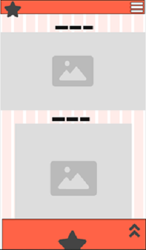
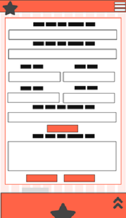
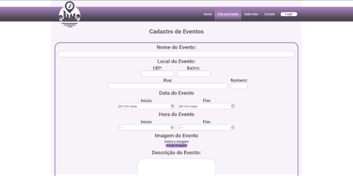
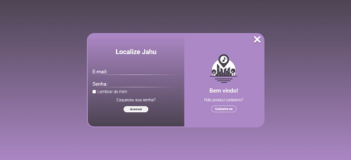
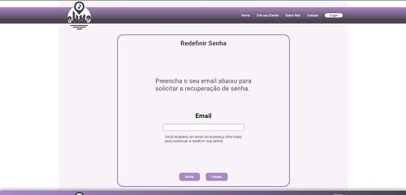

  

- - -
# DOCUMENTAÇÃO DO PROJETO INTERDISCIPLINAR (PI)

## Localize Jahu
Aplicação Web que destaca artistas locais e eventos da comunidade na região de Jaú.

## Autoras
- [Alisa Gabriel](https://github.com/AlissaGabriel), 
- [Evelyn Nataly Aparecida Cassinotte](https://github.com/Evelyn-Cass),
- [Lara Nicoly Ronchesel Ramos](https://github.com/llnick),
- [Raissa Geovana Araujo](https://github.com/raissaaraujo1),
- [Thais Silva de Lima](https://github.com/Thaislima96).

## Sumário

[1.	DESCRIÇÃO DA APLICAÇÃO WEB](https://github.com/Localize-Jahu/Documentos?tab=readme-ov-file#1-descri%C3%A7%C3%A3o-da-aplica%C3%A7%C3%A3o-web)
 [1.1	INTRODUÇÃO](https://github.com/Localize-Jahu/Documentos?tab=readme-ov-file#11-introdu%C3%A7%C3%A3o)
 [1.2	MÉTODOS UTILIZADOS](https://github.com/Localize-Jahu/Documentos?tab=readme-ov-file#12-m%C3%A9todos-utilizados)
 [1.3	CRONOGRAMA DO PROJETO](https://github.com/Localize-Jahu/Documentos?tab=readme-ov-file#13cronograma-do-projeto)
 [2.	OBJETIVOS	](https://github.com/Localize-Jahu/Documentos?tab=readme-ov-file#2-objetivos)
 [2.1	GERAL](https://github.com/Localize-Jahu/Documentos?tab=readme-ov-file#21-geral)
 [2.2	ESPECIFICOS](https://github.com/Localize-Jahu/Documentos?tab=readme-ov-file#22-especificos)
 [3.	DOCUMENTO DE REQUISITOS](https://github.com/Localize-Jahu/Documentos?tab=readme-ov-file#3-documento-de-requisitos)
 [3.1	REQUISITOS FUNCIONAIS](https://github.com/Localize-Jahu/Documentos?tab=readme-ov-file#31-requisitos-funcionais)
 [3.2	REQUISITOS NÃO FUNCIONAIS](https://github.com/Localize-Jahu/Documentos?tab=readme-ov-file#32-requisitos-n%C3%A3o-funcionais)
 [4.	REGRAS DE NEGÓCIO](https://github.com/Localize-Jahu/Documentos?tab=readme-ov-file#4-regras-de-neg%C3%B3cio)
 [4.1	O QUE SERÁ ELABORADO?](https://github.com/Localize-Jahu/Documentos?tab=readme-ov-file#41-o-que-ser%C3%A1-elaborado)	
 [4.2	COMO SERÁ ELABORADO?](https://github.com/Localize-Jahu/Documentos?tab=readme-ov-file#42-como-ser%C3%A1-elaborado)
 [4.3	PARA QUEM SERÁ ELABORADO?](https://github.com/Localize-Jahu/Documentos?tab=readme-ov-file#43-para-quem-ser%C3%A1-elaborado)
 [4.4	QUANTO VAI CUSTAR?](https://github.com/Localize-Jahu/Documentos?tab=readme-ov-file#44-quanto-vai-custar)
 [5.	DESIGN](https://github.com/Localize-Jahu/Documentos?tab=readme-ov-file#5-design)
 [6.	PROTÓTIPO](https://github.com/Localize-Jahu/Documentos?tab=readme-ov-file#6prot%C3%B3tipo)
 [7.	APLICAÇÃO](https://github.com/Localize-Jahu/Documentos?tab=readme-ov-file#7aplica%C3%A7%C3%A3o)	
 [8.	CONSIDERAÇÕES FINAIS	](https://github.com/Localize-Jahu/Documentos?tab=readme-ov-file#8considera%C3%A7%C3%B5es-finais)
 [REFERÊNCIAS BIBLIOGRÁFICAS	](https://github.com/Localize-Jahu/Documentos?tab=readme-ov-file#refer%C3%AAncias-bibliogr%C3%A1ficas)

## 1. DESCRIÇÃO DA APLICAÇÃO WEB

### 1.1. Introdução
No contexto da era digital, a promoção e celebração da cultura local desempenham um papel crucial na preservação da identidade e na construção de comunidades vibrantes e engajadas. A ausência de uma Aplicação Web dedicada à promoção da cultura local em Jaú, representa uma lacuna significativa na divulgação e acesso aos talentos artísticos e eventos da região. A criação da Localize Jahu surge como resposta a essa necessidade, visando amplificar a visibilidade dessas expressões culturais, promover a diversidade artística e estimular a participação da comunidade em atividades culturais.

###	1.2. MÉTODOS UTILIZADOS
Para desenvolver a aplicação web Localize Jahu, pretende-se utilizar uma combinação de ferramentas e tecnologias modernas, visando garantir um desenvolvimento eficiente e robusto do sistema. Entre as ferramentas e tecnologias planejadas estão:

- **Linguagens de Programação:** Utilização de linguagens como HTML, CSS e Javascript para o desenvolvimento da interface do usuário (front-end).

- **Frameworks e Bibliotecas:** Uso de frameworks e bibliotecas como jQuery para o desenvolvimento do front-end.

- **Servidor Web:** Para a hospedagem e gerenciamento do site utilizaremos o GitHub Pages (github.io). Esta escolha se deve à facilidade de integração com o repositório de código no GitHub, permitindo um fluxo de trabalho contínuo e eficiente.
 
- **Ferramentas de Controle de Versão:** Uso de ferramentas de controle de versão como Git e GitHub para gerenciar o código-fonte e colaborar no desenvolvimento em equipe.

- **Modelo de Processo de Desenvolvimento:** O modelo de processo de desenvolvimento escolhido para este projeto é o modelo cascata, devido à sua estrutura linear e sequencial, que permite um planejamento detalhado e uma execução organizada, garantindo que cada fase do desenvolvimento seja concluída antes do início da próxima.

- **Prototipagem:** A abordagem de prototipação também será adotada para validar conceitos e interações do usuário antes do desenvolvimento completo, utilizando a ferramenta Figma.

### 1.3.	CRONOGRAMA DO PROJETO
Para a criação e gestão do cronograma optamos por utilizar a plataforma visual Trello. Esta plataforma oferece uma abordagem visual que permite à equipe gerenciar o projeto, acompanhar o fluxo de trabalho e monitorar as tarefas de forma eficaz.

Segue o link do cronograma: [CRONOGRAMA](https://trello.com/invite/b/JEvkwpPV/ATTI5bc03b08c6dff18c63364e7f118f5b18B8784BA1/localize-jahu)

##	2. OBJETIVOS
###	2.1 GERAL
O Objetivo do Projeto interdisciplinar é desenvolver a aplicação web "Localize Jahu" com a finalidade de conectar as diversas comunidades da região de Jaú aos eventos locais, promovendo a participação em atividades culturais e de entretenimento.

###	2.2. ESPECIFICOS
#### Pesquisar Outras Aplicações de Evento
Pesquisar as principais aplicações de eventos já existentes e analisar suas funcionalidades, como sistemas de busca, filtragem por categorias, notificações e integração com redes sociais. Com objetivo é garantir que a aplicação ofereça uma experiência de usuário comparável às alternativas existentes.

#### Identificar ferramentas
Definir os requisitos técnicos e funcionais da aplicação, considerando aspectos como desenvolvimento front-end, back-end, banco de dados, segurança, escalabilidade e manutenção. Para assegurar que o desenvolvimento da aplicação seja eficiente, seguro e escalável.

## 3. DOCUMENTO DE REQUISITOS
Um documento de requisitos de sistema é uma peça-chave no desenvolvimento de software, especialmente em contextos acadêmicos e profissionais. Ele consiste em um registro detalhado e estruturado dos requisitos que o sistema deve atender para alcançar seus objetivos. Este documento descreve tanto os requisitos funcionais quanto os requisitos não funcionais. Ele serve como um contrato entre os stakeholders do projeto, estabelecendo um entendimento comum das expectativas e garantindo a qualidade e eficácia do software desenvolvido.

### 3.1. REQUISITOS FUNCIONAIS
Requisitos funcionais são as especificações detalhadas das funcionalidades que um sistema deve oferecer para atender às necessidades dos usuários. Eles descrevem as ações que o sistema deve ser capaz de realizar, como cadastro de usuários, pesquisa de informações, processamento de dados, entre outras operações. Esses requisitos são fundamentais para orientar o desenvolvimento do sistema, garantindo que ele cumpra suas finalidades de forma eficaz e atenda aos objetivos propostos no trabalho acadêmico.

#### RF1 - Cadastrar Evento
Permitir que organizadores de eventos cadastrem informações sobre eventos na região, incluindo nome, datas, horários, localização, descrições e imagens de divulgação. Os usuários podem acessar essa funcionalidade através do menu de navegação do site

#### RF2 - Exibir Informações do Evento
Exibir informações detalhadas sobre cada evento cultural listado na plataforma, incluindo nome, datas, horários, localização, descrições, imagens e links para compra de ingressos, se aplicável. Os usuários podem acessar essa funcionalidade clicando em um evento na página inicial do site.

#### RF3 - Exibir Próximos Eventos
Permitir aos usuários visualizarem uma lista dos eventos que ocorrerão em breve. Isso inclui detalhes como o nome, data, horário e descrição breve de cada evento. Os usuários podem acessar essa funcionalidade diretamente na página inicial do site.

#### RF4 - Exibir Sobre Nós
Permite aos usuários conhecerem mais sobre os alunos que desenvolveram o site. Essa seção inclui informações sobre a equipe de desenvolvimento, como nomes, fotos, funções, áreas de expertise e uma breve descrição de cada membro. Além disso, contém detalhes sobre o propósito do projeto, os desafios enfrentados durante o desenvolvimento e os objetivos alcançados. Os usuários podem acessar essas funcionalidades através do menu de navegação do site.

#### RF5 - Exibir Formulário de Contato
A funcionalidade permite aos usuários acessarem informações de contato da equipe responsável pelo site. Essa seção inclui os campos de nome do usuário, endereço de e-mail do usuário, telefone e descrição. Os usuários podem acessar essa funcionalidade através de um link no menu de navegação do site.

#### RF6 - Cadastrar Usuário
A aplicação permitirá que novos usuários se cadastrem ao fornecerem as informações: nome completo, nome de usuário, endereço de e-mail, senha, telefone e CPF. Os usuários podem acessar essa funcionalidade através da página de login do site.

#### RF7 - Realizar Login
A funcionalidade permitirá que os usuários façam login fornecendo seu endereço de e-mail e senha. Os usuários podem acessar essas funcionalidades através do menu de navegação do site.

#### RF8 - Recuperar Senha
A aplicação deve permitir que os usuários solicitem a recuperação da senha fornecendo o endereço de e-mail associado à sua conta. Essa funcionalidade pode ser acessada através da página de login do site.

###	3.2. REQUISITOS NÃO FUNCIONAIS
Os requisitos não funcionais referem-se às características e restrições do sistema que não estão diretamente relacionadas às suas funcionalidades principais, mas que são essenciais para garantir sua qualidade, desempenho e usabilidade. Eles abordam aspectos como segurança, desempenho, usabilidade, compatibilidade, confiabilidade e manutenibilidade do sistema, fornecendo diretrizes cruciais para o desenvolvimento e avaliação do software. Esses requisitos são fundamentais para assegurar que o sistema atenda aos padrões esperados de qualidade e satisfaça as necessidades dos usuários de forma abrangente.

#### RNF 1 - Desempenho:
A aplicação deve ter carregamento rápido, mesmo em conexões de internet mais lentas, para garantir uma boa experiência de usuário.

#### RNF 2 - Usabilidade:
A interface da aplicação deve ser intuitiva e fácil de usar, com navegação clara e design responsivo, para que os usuários possam encontrar facilmente artistas e eventos de interesse.

#### RNF 3 - Compatibilidade com Navegadores:
A aplicação deve ser compatível com os principais navegadores da web, como Google Chrome, Mozilla Firefox, Safari e Microsoft Edge, garantindo uma experiência consistente para todos os usuários.

#### RNF 4 - Acessibilidade:
A aplicação deve ser acessível para pessoas com deficiências, seguindo as diretrizes de acessibilidade da web (WCAG), como fornecer alternativas textuais para conteúdo visual e suporte para leitores de tela.

#### RNF 5 - Manutenibilidade:
O código-fonte da aplicação deve ser bem documentado, seguindo padrões de codificação e boas práticas de desenvolvimento, para facilitar a manutenção e futuras atualizações do sistema.

## 4. REGRAS DE NEGÓCIO
Para a elaboração do modelo de negócio decidimos utilizar o Modelo de Negócio Canvas, no qual permite que planejemos de forma concisa e visual os principais aspectos da aplicação web, como seu público-alvo, proposta de valor, canais de distribuição, fontes de receita e estrutura de custos. Ajudando a equipe a entender o mercado, definir uma estratégia clara e criar valor para os usuários e a comunidade local de forma eficiente. Na figura 1 é mostrado o modelo de negócios canvas da aplicação.

Figura 1 - Modelo de Negócios Canvas

Fonte: Elaborado pelas autoras (2024)

###	4.1 O QUE SERÁ ELABORADO?
#### Proposta de valor
Uma plataforma centralizada e acessível, fácil acesso a uma variedade de eventos culturais, exposições de arte, apresentações musicais e outras atividades artísticas que acontecem em jaú, promoção do trabalho de artistas locais, promover eventos e iniciativas culturais.

### 4.2. COMO SERÁ ELABORADO?
#### Parcerias principais
Artistas locais, espaços culturais, empresas locais, instituições de ensino e promotores de eventos.

#### Atividades principais
Divulgação de eventos culturais, suporte ao cliente e desenvolvimento da plataforma.

#### Recursos principais
Equipe de desenvolvimento, internet, plataforma de hospedagem e conteúdo e informações.

### 4.3. PARA QUEM SERÁ ELABORADO?
#### Relacionamento Com Clientes
Atendimento ao cliente (E-mail), comunicação proativa e feedback dos Usuários

#### Canais
Website, redes sociais, parcerias locais e recomendações pessoais

#### Segmento de Clientes
Usuários locais: residentes de jaú, visitantes, artistas locais: músicos, artistas plásticos, escritores, dançarinos e outros profissionais da área cultural, empresas e instituições culturais: empresas locais, espaços culturais, museus, galerias de arte e outras, patrocinadores e investidores.

###	4.4. QUANTO VAI CUSTAR?
#### Estrutura de Custo
Desenvolvimento e manutenção da plataforma, hospedagem, infraestrutura, registro e a renovação do domínio e tempo.

#### Fontes de Receita
Devido ao caráter educacional e acadêmico deste projeto, não estamos considerando fontes de receita.

## 5. DESIGN
O design do Localize Jahu será centrado na experiência do usuário, com uma interface limpa, intuitiva e atraente que facilite a navegação e a descoberta de artistas locais e eventos culturais em Jaú. 

### 5.1 Paleta de cor
A paleta de cores do site foi cuidadosamente selecionada para refletir criatividade, inovação, elegância e curiosidade sobre a cena cultural de Jaú. Na figura 2, é apresentada a paleta de cores da aplicação.

Figura 2 - Paleta de Cores

Fonte: Elaborado pelas autoras (2024)

### 5.2. Tipografia
A tipografia é um aspecto fundamental do design do site, pois influencia diretamente a legibilidade, a estética e a experiência do usuário. Para o Localize Jahu escolhemos a fonte Roboto, conhecida por sua clareza, modernidade e versatilidade. Na figura 3, é mostrado um exemplo de uso da fonte Roboto.

Figura 2 - Paleta de Cores

Fonte: Roboto. Disponível em: <https://fonts.adobe.com/fonts/roboto>. Acesso em: 15 maio. 2024.

Figura 4 - Isotipo da Localize Jahu

### 5.3. Isotipo
O Isotipo escolhido para a Localize Jahu desempenha um papel crucial na representação visual da marca e na comunicação de sua identidade única. Na figura4, é mostrado o Isotipo escolhido para aplicação.

Figura 3 - Isotipo da Localize Jahu

Fonte: Elaborado pelas autoras (2024)

### 5.4. Wireframe
Um Wireframe é uma representação esquemática e simplificada da disposição dos elementos da interface, sem considerar detalhes visuais como cores, imagens ou tipografia. Na concepção do Localize Jahu, o Wireframe foi uma etapa crucial no processo de design, pois permitiu a criação de uma estrutura visual básica que serviu como guia para o desenvolvimento do protótipo e da interface final. 

#### Versão Desktop e Tablet
Para o desenvolvimento dos Wireframes da aplicação web para Desktop e Tablet, utilizamos um único modelo base. Esse modelo foi apenas ajustando a escala conforme necessário. Essa abordagem nos permitiu manter a consistência visual e funcional entre as diferentes versões, garantindo uma experiência de usuário fluida e intuitiva em ambos os dispositivos. Da figura 5 até a figura 12, é mostrado os Wireframes das versões Desktop e Tablet. 

Figura 5 - Wireframe Desktop e Tablet - Home

 
Fonte: Elaborado pelas autoras (2024)

Figura 6 - Wireframe Desktop e Tablet - Exibir Evento
 

Fonte: Elaborado pelas autoras (2024)

Figura 7 - Wireframe Desktop e Tablet - Cadastrar Evento

Fonte: Elaborado pelas autoras (2024)

Figura 8 - Wireframe Desktop e Tablet - Sobre Nós

Fonte: Elaborado pelas autoras (2024)

Figura 9 - Wireframe Desktop e Tablet - Exibir Contato

Fonte: Elaborado pelas autoras (2024)

Figura 10 - Wireframe Desktop e Tablet - Realizar Login

Fonte: Elaborado pelas autoras (2024)

Figura 11 - Wireframe Desktop e Tablet - Cadastrar Usuário

Fonte: Elaborado pelas autoras (2024)

Figura 12 - Wireframe Desktop e Tablet - Recuperar Senha

Fonte: Elaborado pelas autoras (2024)

#### Versão Mobile
A versão mobile da aplicação foi desenvolvida com foco em proporcionar uma experiência de usuário otimizada para dispositivos móveis. No Wireframe da versão Mobile, ajustamos a escala e reorganizamos os elementos para garantir uma navegação intuitiva e funcional em telas menores. Priorizamos a usabilidade e a acessibilidade, assegurando que todas as funcionalidades importantes estivessem facilmente acessíveis, mantendo a coerência visual e a identidade do Localize Jahu em todos os dispositivos. Da figura 13 até a figura 20, é mostrado os Wireframes da versão Mobile.

Figura 13 - Wireframe Mobile - Home

Fonte: Elaborado pelas autoras (2024)

Figura 14 - Wireframe Mobile - Exibir Evento

Fonte: Elaborado pelas autoras (2024)

Figura 15 - Wireframe Mobile - Exibir Evento

Fonte: Elaborado pelas autoras (2024)

Figura 16 - Wireframe Mobile - Cadastrar Evento

Fonte: Elaborado pelas autoras (2024)

Figura 17 - Wireframe Mobile - Cadastrar Evento

Fonte: Elaborado pelas autoras (2024)

Figura 18 - Wireframe Mobile - Realizar Login

Fonte: Elaborado pelas autoras (2024)

 
Figura 19 - Wireframe Mobile - Cadastrar Usuário

Fonte: Elaborado pelas autoras (2024)

 
Figura 20 - Wireframe Mobile - Recuperar Senha

Fonte: Elaborado pelas autoras (2024)
 
 

### 5.5. Modelo de navegação
O modelo de navegação permite que os visitantes se movam de uma página para outra com o mínimo esforço. Além disso, ele facilita a rápida identificação das relações entre as páginas, ajudando o usuário a decidir se deseja continuar em uma jornada específica dentro do site ou mudar para outra seção disponível. Na figura 21, é mostrado o modelo de navegação da aplicação.

Figura 21 - Modelo de Navegação

Fonte: Elaborado pelas autoras (2024)

## 6.	PROTÓTIPO 
Foi utilizado o Figma na elaboração do protótipo, visando gerar uma representação visual interativa da interface da aplicação web. Por meio dele, desenvolvemos uma versão funcional e realista do design, permitindo aos stakeholders testarem e aprimorarem o conceito antes da implementação final.

Segue o link do protótipo: [PROTÓTIPO](https://www.figma.com/file/6b4daerIKXVNAeEldSNjRG/Modelos-Com-Grid?type=design&node-id=0%3A1&mode=design&t=wDsq5vqsbs1eH5YM-1)

## 7	APLICAÇÃO
O processo de criação da aplicação web envolveu diversas etapas para garantir um desenvolvimento eficiente e eficaz. A aplicação web está disponível através dos seguinte link: https://github.com/Localize-Jahu/Localize-Jahu.github.io e https://localize-jahu.github.io.

#### HTML
Foi utilizado o HTML para criar a estrutura da página, definindo elementos como cabeçalhos, parágrafos, listas e formulários. Também foram aplicadas tags semânticas do HTML5 para melhorar a acessibilidade e a indexação nos mecanismos de busca, garantindo uma base sólida para a aplicação.

#### CSS
No CSS foi empregado para estilizar os elementos HTML, aplicando cores, fontes, tamanhos, espaçamentos e outras propriedades visuais para criar um layout atraente e coeso. Técnicas de design responsivo foram utilizadas para garantir que a aplicação seja exibida de forma adequada em diferentes dispositivos e tamanhos de tela, adaptando-se automaticamente às necessidades do usuário.

#### Javascript
O JavaScript foi empregado para adicionar interatividade e dinamismo à aplicação, melhorando a experiência do usuário nas páginas. Utilizamos essa linguagem para implementar diversas funcionalidades interativas e efeitos visuais. A biblioteca jQuery também foi usada para simplificar e agilizar o desenvolvimento de componentes interativos e responsivos, como o carrossel. Nas figuras 22 até 29, são mostradas as telas da versão Desktop. Na figura 30, é mostrado a tela principal da versão mobile.
 

Figura 22 - Aplicação Desktop - Página Principal

Fonte: Elaborado pelas autoras (2024)

Figura 23 - Aplicação Desktop - Exibir Evento
 

Fonte: Elaborado pelas autoras (2024)

Figura 24 - Aplicação Desktop - Exibir Sobre Nós
 

Fonte: Elaborado pelas autoras (2024)

Figura 25 - Aplicação Desktop - Cadastrar Evento
 

Fonte: Elaborado pelas autoras (2024)

Figura 26 - Aplicação Desktop - Contato
 

Fonte: Elaborado pelas autoras (2024)

Figura 27 - Aplicação Desktop - Realizar Login
 

Fonte: Elaborado pelas autoras (2024)

Figura 28 - Aplicação Desktop - Cadastrar Usuário
 

Fonte: Elaborado pelas autoras (2024)

Figura 29 - Aplicação Desktop - Recuperar Senha
 

Fonte: Elaborado pelas autoras (2024)

Figura 30 - Aplicação Mobile - Página Principal
 

Fonte: Elaborado pelas autoras (2024)

## 8.	CONSIDERAÇÕES FINAIS
Durante o processo de desenvolvimento da aplicação, foram adotadas diversas metodologias e ferramentas para garantir a eficácia e alinhamento com os objetivos do projeto. Desde a fase inicial de pesquisa, cada etapa foi meticulosamente planejada e executada para atender às demandas da comunidade de Jaú.

No entanto, é importante reconhecer as limitações e desafios enfrentados ao longo do desenvolvimento. Restrições de tempo, recursos limitados e a complexidade de integração de diferentes funcionalidades foram alguns dos obstáculos encontrados. Além disso, é importante ressaltar que os objetivos desta fase inicial do projeto são poucos e não suficientes para uma aplicação que será desenvolvida no período de três anos. Estes objetivos iniciais só se referem à primeira fase do projeto. Durante as próximas fases, serão adicionadas funcionalidades que tragam mais visibilidade, engajamento e outras melhorias para a plataforma.

A aplicação Localize Jahu tem o potencial de impactar positivamente a promoção da cultura local em Jaú, destacando artistas locais, eventos culturais e histórias da comunidade. Ao oferecer uma plataforma dedicada a essas expressões culturais, busca-se fortalecer e enriquecer os laços entre os membros da comunidade e apoiar o desenvolvimento artístico e cultural da região.

## REFERÊNCIAS BIBLIOGRÁFICAS

Fernando Cunha. Requisitos funcionais e não funcionais: o que são?  Disponível em: https://www.mestresdaweb.com.br/tecnologias/requisitos-funcionais-e-nao-funcionais-o-que-sao. Acesso em: 29 abr. 2024.

Casa do Desenvolvedor. Requisitos funcionais e não funcionais: o que são e como identificar? Disponível em: https://blog.casadodesenvolvedor.com.br/requisitos-funcionais-e-nao-funcionais/. Acesso em: 29 abr. 2024.

Cursos PM3. Aplicação web: o que é, características, princípios e como criar. Disponível em: https://www.cursospm3.com.br/blog/aplicacao-web/. Acesso em: 29 abr. 2024.

Navegação do site | Guia com dicas e boas práticas | Mailchimp. Disponível em: <https://mailchimp.com/pt-br/resources/best-practices-for-website-navigation/#:~:text=A%20estrutura%20de%20navega%C3%A7%C3%A3o%20permite>. Acesso em: 16 maio. 2024.

 FIGMA. Figma Documentation. Disponível em: https://help.figma.com. Acesso em: 05 jun. 2024.
 
GITHUB. GitHub Documentation. Disponível em: https://docs.github.com. Acesso em: 05 jun. 2024.

GITHUB PAGES. GitHub Pages Documentation. Disponível em: https://pages.github.com. Acesso em: 05 jun. 2024.

TRELLO. Trello Help. Disponível em: https://help.trello.com. Acesso em: 05 jun. 2024.

STACK OVERFLOW. Stack Overflow: Where Developers Learn, Share, & Build Careers. Disponível em: https://stackoverflow.com. Acesso em: 05 jun. 2024.

W3SCHOOLS. W3Schools Online Web Tutorials. Disponível em: https://www.w3schools.com/. Acesso em: 05 jun. 2024.

CSS-TRICKS. A Complete Guide to Flexbox. Disponível em: https://css-tricks.com/snippets/css/a-guide-to-flexbox/. Acesso em: 05 jun. 2024.

BRASILCODE. 35 Botões CSS com Animação. Disponível em: https://www.brasilcode.com.br/35-botoes-css-com-animacao/. Acesso em: 05 jun. 2024.

CODEPEN. CodePen: Social Development Environment. Disponível em: https://codepen.io/. Acesso em: 05 jun. 2024.

## Fale conosco

Se tiver alguma dúvida, sugestão ou feedback sobre a aplicação, não hesite em nos contatar. 
Estamos aqui para ajudar e ouvir suas opiniões para melhorar continuamente o projeto.

[Evelyn Cassinotte](mailto:evelyn.cassinotte@fatec.sp.gov.br)

- - -

Agradecemos a todos os envolvidos na realização deste projeto e esperamos que ele sirva como uma base sólida para futuros desenvolvimentos e aprendizados.
