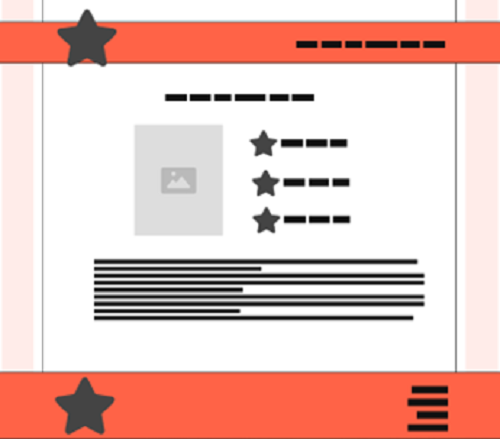
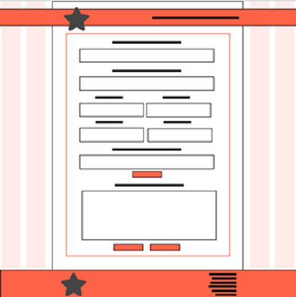
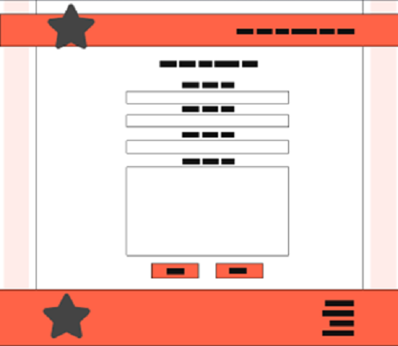

  

- - -
# DOCUMENTAÇÃO DO PROJETO INTERDISCIPLINAR (PI)

## Localize Jahu
Aplicação Web que destaca artistas locais e eventos da comunidade na região de Jaú.

## Autoras
- [Alisa Gabriel](https://github.com/AlissaGabriel), 
- [Evelyn Nataly Aparecida Cassinotte](https://github.com/Evelyn-Cass),
- [Lara Nicoly Ronchesel Ramos](https://github.com/llnick),
- [Raissa Geovana Araujo](https://github.com/raissaaraujo1),
- [Thais Silva de Lima](https://github.com/Thaislima96).

## Sumário

## 1. DESCRIÇÃO DA APLICAÇÃO WEB

### 1.1. Introdução
No contexto da era digital, a promoção e celebração da cultura local desempenham um papel crucial na preservação da identidade e na construção de comunidades vibrantes e engajadas. A ausência de uma Aplicação Web dedicada à promoção da cultura local em Jaú, representa uma lacuna significativa na divulgação e acesso aos talentos artísticos e eventos da região. A criação da Localize Jahu surge como resposta a essa necessidade, visando amplificar a visibilidade dessas expressões culturais, promover a diversidade artística e estimular a participação da comunidade em atividades culturais.

###	1.2. MÉTODOS UTILIZADOS
Para desenvolver a aplicação web Localize Jahu, pretende-se utilizar uma combinação de ferramentas e tecnologias modernas, visando garantir um desenvolvimento eficiente e robusto do sistema. Entre as ferramentas e tecnologias planejadas estão:

- **Linguagens de Programação:** Utilização de linguagens como HTML, CSS e Javascript para o desenvolvimento da interface do usuário (front-end).

- **Frameworks e Bibliotecas:** Uso de frameworks e bibliotecas como jQuery para o desenvolvimento do front-end.

- **Servidor Web:** Para a hospedagem e gerenciamento do site utilizaremos o GitHub Pages (github.io). Esta escolha se deve à facilidade de integração com o repositório de código no GitHub, permitindo um fluxo de trabalho contínuo e eficiente.
 
- **Ferramentas de Controle de Versão:** Uso de ferramentas de controle de versão como Git e GitHub para gerenciar o código-fonte e colaborar no desenvolvimento em equipe.

- **Modelo de Processo de Desenvolvimento:** O modelo de processo de desenvolvimento escolhido para este projeto é o modelo cascata, devido à sua estrutura linear e sequencial, que permite um planejamento detalhado e uma execução organizada, garantindo que cada fase do desenvolvimento seja concluída antes do início da próxima.

- **Prototipagem:** A abordagem de prototipação também será adotada para validar conceitos e interações do usuário antes do desenvolvimento completo, utilizando a ferramenta Figma.

### 1.3.	CRONOGRAMA DO PROJETO
Para a criação e gestão do cronograma optamos por utilizar a plataforma visual Trello. Esta plataforma oferece uma abordagem visual que permite à equipe gerenciar o projeto, acompanhar o fluxo de trabalho e monitorar as tarefas de forma eficaz.

Segue o link do cronograma: [CRONOGRAMA](https://trello.com/invite/b/JEvkwpPV/ATTI5bc03b08c6dff18c63364e7f118f5b18B8784BA1/localize-jahu)

##	2. OBJETIVOS
###	2.1 GERAL
O Objetivo do Projeto interdisciplinar é desenvolver a aplicação web "Localize Jahu" com a finalidade de conectar as diversas comunidades da região de Jaú aos eventos locais, promovendo a participação em atividades culturais e de entretenimento.

###	2.2. ESPECIFICOS
#### Pesquisar Outras Aplicações de Evento
Pesquisar as principais aplicações de eventos já existentes e analisar suas funcionalidades, como sistemas de busca, filtragem por categorias, notificações e integração com redes sociais. Com objetivo é garantir que a aplicação ofereça uma experiência de usuário comparável às alternativas existentes.

#### Identificar ferramentas
Definir os requisitos técnicos e funcionais da aplicação, considerando aspectos como desenvolvimento front-end, back-end, banco de dados, segurança, escalabilidade e manutenção. Para assegurar que o desenvolvimento da aplicação seja eficiente, seguro e escalável.

## 3. DOCUMENTO DE REQUISITOS
Um documento de requisitos de sistema é uma peça-chave no desenvolvimento de software, especialmente em contextos acadêmicos e profissionais. Ele consiste em um registro detalhado e estruturado dos requisitos que o sistema deve atender para alcançar seus objetivos. Este documento descreve tanto os requisitos funcionais quanto os requisitos não funcionais. Ele serve como um contrato entre os stakeholders do projeto, estabelecendo um entendimento comum das expectativas e garantindo a qualidade e eficácia do software desenvolvido.

### 3.1. REQUISITOS FUNCIONAIS
Requisitos funcionais são as especificações detalhadas das funcionalidades que um sistema deve oferecer para atender às necessidades dos usuários. Eles descrevem as ações que o sistema deve ser capaz de realizar, como cadastro de usuários, pesquisa de informações, processamento de dados, entre outras operações. Esses requisitos são fundamentais para orientar o desenvolvimento do sistema, garantindo que ele cumpra suas finalidades de forma eficaz e atenda aos objetivos propostos no trabalho acadêmico.

#### RF1 - Cadastrar Evento
Permitir que organizadores de eventos cadastrem informações sobre eventos na região, incluindo nome, datas, horários, localização, descrições e imagens de divulgação. Os usuários podem acessar essa funcionalidade através do menu de navegação do site

#### RF2 - Exibir Informações do Evento
Exibir informações detalhadas sobre cada evento cultural listado na plataforma, incluindo nome, datas, horários, localização, descrições, imagens e links para compra de ingressos, se aplicável. Os usuários podem acessar essa funcionalidade clicando em um evento na página inicial do site.

#### RF3 - Exibir Próximos Eventos
Permitir aos usuários visualizarem uma lista dos eventos que ocorrerão em breve. Isso inclui detalhes como o nome, data, horário e descrição breve de cada evento. Os usuários podem acessar essa funcionalidade diretamente na página inicial do site.

#### RF4 - Exibir Sobre Nós
Permite aos usuários conhecerem mais sobre os alunos que desenvolveram o site. Essa seção inclui informações sobre a equipe de desenvolvimento, como nomes, fotos, funções, áreas de expertise e uma breve descrição de cada membro. Além disso, contém detalhes sobre o propósito do projeto, os desafios enfrentados durante o desenvolvimento e os objetivos alcançados. Os usuários podem acessar essas funcionalidades através do menu de navegação do site.

#### RF5 - Exibir Formulário de Contato
A funcionalidade permite aos usuários acessarem informações de contato da equipe responsável pelo site. Essa seção inclui os campos de nome do usuário, endereço de e-mail do usuário, telefone e descrição. Os usuários podem acessar essa funcionalidade através de um link no menu de navegação do site.

###	3.2. REQUISITOS NÃO FUNCIONAIS
Os requisitos não funcionais referem-se às características e restrições do sistema que não estão diretamente relacionadas às suas funcionalidades principais, mas que são essenciais para garantir sua qualidade, desempenho e usabilidade. Eles abordam aspectos como segurança, desempenho, usabilidade, compatibilidade, confiabilidade e manutenibilidade do sistema, fornecendo diretrizes cruciais para o desenvolvimento e avaliação do software. Esses requisitos são fundamentais para assegurar que o sistema atenda aos padrões esperados de qualidade e satisfaça as necessidades dos usuários de forma abrangente.

#### RNF 1 - Desempenho:
A aplicação deve ter carregamento rápido, mesmo em conexões de internet mais lentas, para garantir uma boa experiência de usuário.

#### RNF 2 - Usabilidade:
A interface da aplicação deve ser intuitiva e fácil de usar, com navegação clara e design responsivo, para que os usuários possam encontrar facilmente artistas e eventos de interesse.

#### RNF 3 - Compatibilidade com Navegadores:
A aplicação deve ser compatível com os principais navegadores da web, como Google Chrome, Mozilla Firefox, Safari e Microsoft Edge, garantindo uma experiência consistente para todos os usuários.

#### RNF 4 - Acessibilidade:
A aplicação deve ser acessível para pessoas com deficiências, seguindo as diretrizes de acessibilidade da web (WCAG), como fornecer alternativas textuais para conteúdo visual e suporte para leitores de tela.

#### RNF 5 - Manutenibilidade:
O código-fonte da aplicação deve ser bem documentado, seguindo padrões de codificação e boas práticas de desenvolvimento, para facilitar a manutenção e futuras atualizações do sistema.

## 4. REGRAS DE NEGÓCIO
Para a elaboração do modelo de negócio decidimos utilizar o Modelo de Negócio Canvas, no qual permite que planejemos de forma concisa e visual os principais aspectos da aplicação web, como seu público-alvo, proposta de valor, canais de distribuição, fontes de receita e estrutura de custos. Ajudando a equipe a entender o mercado, definir uma estratégia clara e criar valor para os usuários e a comunidade local de forma eficiente. Na figura 1 é mostrado o modelo de negócios canvas da aplicação.

Figura 1 - Modelo de Negócios Canvas

Fonte: Elaborado pelas autoras (2024)

###	4.1 O QUE SERÁ ELABORADO?
#### Proposta de valor
Uma plataforma centralizada e acessível, fácil acesso a uma variedade de eventos culturais, exposições de arte, apresentações musicais e outras atividades artísticas que acontecem em jaú, promoção do trabalho de artistas locais, promover eventos e iniciativas culturais.

### 4.2. COMO SERÁ ELABORADO?
#### Parcerias principais
Artistas locais, espaços culturais, empresas locais, instituições de ensino e promotores de eventos.

#### Atividades principais
Divulgação de eventos culturais, suporte ao cliente e desenvolvimento da plataforma.

#### Recursos principais
Equipe de desenvolvimento, internet, plataforma de hospedagem e conteúdo e informações.

### 4.3. PARA QUEM SERÁ ELABORADO?
#### Relacionamento Com Clientes
Atendimento ao cliente (E-mail), comunicação proativa e feedback dos Usuários

#### Canais
Website, redes sociais, parcerias locais e recomendações pessoais

#### Segmento de Clientes
Usuários locais: residentes de jaú, visitantes, artistas locais: músicos, artistas plásticos, escritores, dançarinos e outros profissionais da área cultural, empresas e instituições culturais: empresas locais, espaços culturais, museus, galerias de arte e outras, patrocinadores e investidores.

###	4.4. QUANTO VAI CUSTAR?
#### Estrutura de Custo
Desenvolvimento e manutenção da plataforma, hospedagem, infraestrutura, registro e a renovação do domínio e tempo.

#### Fontes de Receita
Devido ao caráter educacional e acadêmico deste projeto, não estamos considerando fontes de receita.

## 5. DESIGN
O design do Localize Jahu será centrado na experiência do usuário, com uma interface limpa, intuitiva e atraente que facilite a navegação e a descoberta de artistas locais e eventos culturais em Jaú. 

### 5.1 Paleta de cor
A paleta de cores do site foi cuidadosamente selecionada para refletir criatividade, inovação, elegância e curiosidade sobre a cena cultural de Jaú. Na figura 2, é apresentada a paleta de cores da aplicação.

Figura 2 - Paleta de Cores

Fonte: Elaborado pelas autoras (2024)

### 5.2. Tipografia
A tipografia é um aspecto fundamental do design do site, pois influencia diretamente a legibilidade, a estética e a experiência do usuário. Para o Localize Jahu escolhemos a fonte Roboto, conhecida por sua clareza, modernidade e versatilidade. Na figura 3, é mostrado um exemplo de uso da fonte Roboto.

Figura 2 - Paleta de Cores

Fonte: Roboto. Disponível em: <https://fonts.adobe.com/fonts/roboto>. Acesso em: 15 maio. 2024.

Figura 4 - Isotipo da Localize Jahu

### 5.3. Isotipo
O Isotipo escolhido para a Localize Jahu desempenha um papel crucial na representação visual da marca e na comunicação de sua identidade única. Na figura4, é mostrado o Isotipo escolhido para aplicação.

Figura 3 - Isotipo da Localize Jahu

Fonte: Elaborado pelas autoras (2024)

### 5.4. Wireframe
Um Wireframe é uma representação esquemática e simplificada da disposição dos elementos da interface, sem considerar detalhes visuais como cores, imagens ou tipografia. Na concepção do Localize Jahu, o Wireframe foi uma etapa crucial no processo de design, pois permitiu a criação de uma estrutura visual básica que serviu como guia para o desenvolvimento do protótipo e da interface final. 

#### Versão Desktop e Tablet
Para o desenvolvimento dos Wireframes da aplicação web para Desktop e Tablet, utilizamos um único modelo base. Esse modelo foi apenas ajustando a escala conforme necessário. Essa abordagem nos permitiu manter a consistência visual e funcional entre as diferentes versões, garantindo uma experiência de usuário fluida e intuitiva em ambos os dispositivos. Da figura 5 até a figura 9, é mostrado os Wireframes das versões Desktop e Tablet. 

Figura 5 - Wireframe Desktop e Tablet - Home

 
Fonte: Elaborado pelas autoras (2024)

Figura 6 - Wireframe Desktop e Tablet - Exibir Evento
 

Fonte: Elaborado pelas autoras (2024)

Figura 7 - Wireframe Desktop e Tablet - Cadastrar Evento

Fonte: Elaborado pelas autoras (2024)

Figura 8 - Wireframe Desktop e Tablet - Sobre Nós

Fonte: Elaborado pelas autoras (2024)

Figura 9 - Wireframe Desktop e Tablet - Exibir Contato

Fonte: Elaborado pelas autoras (2024)

## Fale conosco

Se tiver alguma dúvida, sugestão ou feedback sobre a aplicação, não hesite em nos contatar. 
Estamos aqui para ajudar e ouvir suas opiniões para melhorar continuamente o projeto.

[Evelyn Cassinotte](mailto:evelyn.cassinotte@fatec.sp.gov.br)

- - -

Agradecemos a todos os envolvidos na realização deste projeto e esperamos que ele sirva como uma base sólida para futuros desenvolvimentos e aprendizados.
